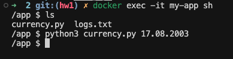
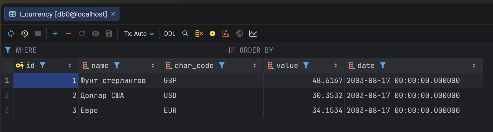
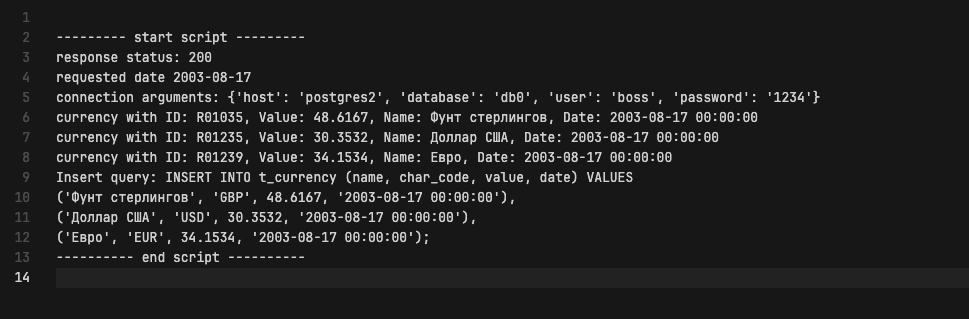

# Docker

## Приложение.

В качестве приложения буду использовать [Python-скрипт](app/currency.py), который делает GET запрос по адресу Центрального Банка РФ, для получения информации о курсе валют (`https://www.cbr.ru/scripts/XML_daily.asp?date_req=dd.mm.YYYY`). Ответ приходит в формает XML, далее мы парсим его с помощью библиотеки xml.etree.ElementTree и выбираем интересующие нас валюты: доллар США, Евро и Фунт стерлингов Соединенного Королевства. По умолчанию курс берется на `02.03.2002`, но можно передать интересующую дату с помощью аргументов командной строки.

```python
query_params = "?date_req=02.03.2002"
date = datetime.datetime.strptime("02.03.2002", "%d.%m.%Y")
if len(sys.argv) > 1:
    date = datetime.datetime.strptime(sys.argv[1], "%d.%m.%Y")
    query_params = "?date_req=" + sys.argv[1]

response = requests.get("https://www.cbr.ru/scripts/XML_daily.asp" + query_params)

root = ET.fromstring(response.content)

currencyIDs = {"R01035", "R01235", "R01239"} # USD, EUR, GBP
```

Далее из переменной окружающей среды мы берем конфигурацию для подключения к PostgeSQL (находится в одной с нами сети). Подключаемся, создаем таблицу (если не создана), в которой будем хранить историю запросов и записываем в нее полученную информацию.

```python
conn_args = {
    "host": "postgres",
    "database": os.environ.get("POSTGRES_DB"),
    "user": os.environ.get("POSTGRES_USER"),
    "password": os.environ.get("POSTGRES_PASSWORD"),
}

with psycopg2.connect(**conn_args) as conn:
    with conn.cursor() as cursor:
        values = []
        isFirst = True
        for valute in root.findall("Valute"):
            valute_id = valute.get("ID")
            if valute_id in currencyIDs:
                if not isFirst:
                    values[-1] += ","
                isFirst = False

                char_code = valute.find("CharCode").text
                value = float(valute.find("Value").text.replace(",", ".", 1))
                name = valute.find("Name").text
                values.append(f"('{name}', '{char_code}', {value}, '{date}')")

        insert_query = "INSERT INTO t_currency (name, char_code, value, date) VALUES\n" + "\n".join(values) + ";"
        logs.append("Insert query: " + insert_query)

        cursor.execute(insert_query)
        conn.commit()
```

Также дополнительно будем производить логгирование в файл [logs.txt](app/logs.txt).

## Развертка контейнеров

Будем использовать PostgreSQL в качестве БД и alpine как систему, где будем запускать приложение.

Для работы скрипта потребуются библиотеки psycopg2-binary и requests, которые укажем в [requirements.txt](requirements.txt)

```
psycopg2-binary
requests
```

image alpine с зависимостями соберем с помощью [Dockerfile](Dockerfile)

```sh
FROM alpine:3.19

RUN apk add --no-cache python3 py3-pip libpq && rm -rf /var/cache/apk/*

COPY requirements.txt .
RUN pip3 install --no-cache-dir --break-system-packages -r requirements.txt

RUN adduser -S -D -H -u 10001 appuser

USER appuser
WORKDIR /app

CMD ["sh"]
```

После чего поднимем контейнеры с помощью [docker-compose](docker-compose.yml) файла

```yml
services:
  postgres2:
    image: postgres:16
    container_name: postgres2
    environment:
      POSTGRES_USER: boss
      POSTGRES_PASSWORD: 1234
      POSTGRES_DB: db0
    ports:
      - "5432:5432"
    volumes:
      - ./postgres_data:/var/lib/postgresql/data
    networks:
      - my_net
    healthcheck:
      test: ["CMD-SHELL", "pg_isready -U boss -d db0"]
      interval: 2s
      timeout: 5s
      retries: 30

  migrate:
    image: postgres:16
    volumes:
      - ./migrations:/migrations
    environment:
      PGHOST: postgres2
      PGUSER: boss
      PGPASSWORD: "1234"
      PGDATABASE: db0
    command: ["psql", "-v", "ON_ERROR_STOP=1", "-f", "/migrations/01_init.sql"]
    depends_on:
      postgres2:
        condition: service_healthy
    networks:
      - my_net
    restart: "no"

  my-app:
    image: my-app
    container_name: my-app
    working_dir: /app
    volumes:
      - ./app:/app
    environment:
      POSTGRES_HOST: postgres2
      POSTGRES_USER: boss
      POSTGRES_PASSWORD: 1234
      POSTGRES_DB: db0
    command: ["sleep", "infinity"]
    depends_on:
      migrate:
        condition: service_completed_successfully
    networks:
      - my_net

networks:
  my_net:
    driver: bridge
```

Билдим имадж

```sh
docker build -t my-app .
```

Поднимаем

```sh
docker-compose up
```

Заходим в my-app командой

```sh
docker exec -it my-app sh
```

Запускаем python-скрипт командой (укажем дату, например, 17.08.2003).

```python
python3 currency.py 17.08.2003
```



Ошибок нет. Проверим нашу БД, видим, что данные успешно добавились:



Логи также записались корректно

